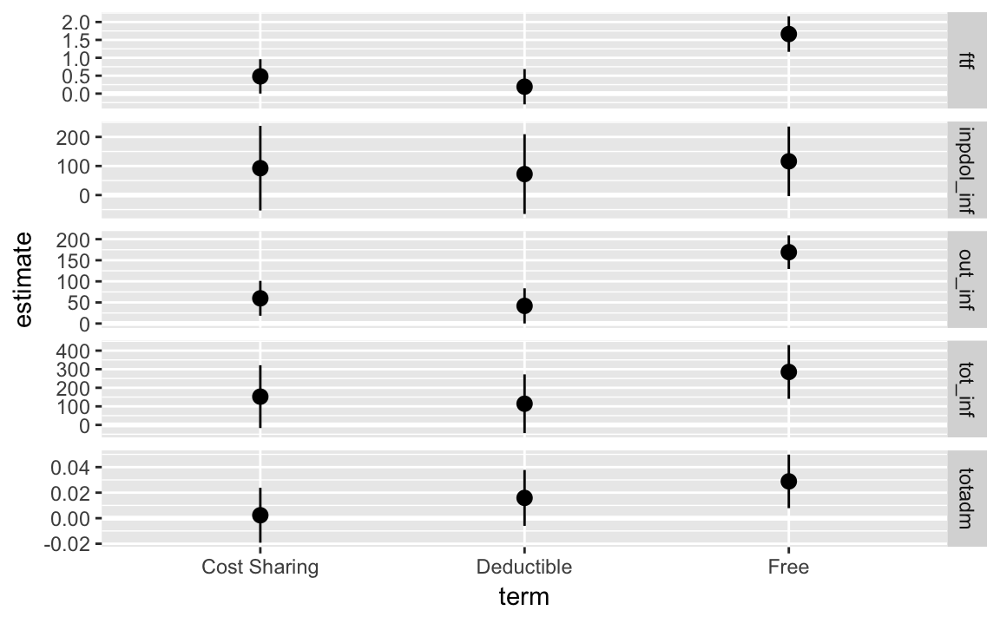

---
output: html_document
editor_options: 
  chunk_output_type: console
---
# RAND Health Insurance Experiment (HIE)

This provides code replicates the Tables 1.3 and 1.4 of @AngristPischke2014 which replicate the analyses from the RAND Health Insurance Experiment [@BrookWareEtAl1983,@Aron-DineEinavEtAl2013].

Load necessary libraries.

```r
library("tidyverse")
library("broom")
library("haven")
library("rlang")
library("clubSandwich")
```

Function to calculate sclustered standard errors and return a tidy data frame of the coefficients and standard errors.

```r
cluster_se <- function(mod, cluster, type = "CR2") {
  vcov <- vcovCR(mod, cluster = cluster, type = "CR2")
  coef_test(mod, vcov = vcov) %>%
    rownames_to_column(var = "term") %>%
    as_tibble() %>%
    select(term, estimate = beta, std.error = SE)
}
```

## Table 1.3

@AngristPischke2014 Table 1.3 presents demographic and baseline health characteristics for subjects of the RAND Health Insurance Experiment (HIE).

Load the `rand` data.

```r
data("rand_sample", package = "masteringmetrics")
```


Calculate the number in each plan:

```r
plantypes <- count(rand_sample, plantype)
```

```r
knitr::kable(plantypes)
```


plantype           n
-------------  -----
Catastrophic     759
Deductible       881
Coinsurance     1022
Free            1295


For each variable variables, estimate the the difference in means between heath insurance plan types.

```r
varlist <- c("female", "blackhisp", "age", "educper",
             "income1cpi", "hosp", "ghindx", "cholest", "diastol",
             "systol", "mhi", "ghindxx",
             "cholestx", "diastolx", "systolx", "mhix")
		
```


Create column (1) with the mean and standard deviation of the "Catastrophic" plan,

```r
catastrophic_stats <- rand_sample %>%
  filter(plantype == "Catastrophic") %>%
  select(one_of(varlist)) %>%
  gather(variable, value) %>%
  group_by(variable) %>%
  summarise(Mean = mean(value, na.rm = TRUE),
            `Std. Dev.` = sd(value, na.rm = TRUE))
```


```r
knitr::kable(catastrophic_stats, digits = 3)
```


variable          Mean   Std. Dev.
-----------  ---------  ----------
age           3.24e+01    1.29e+01
blackhisp     1.72e-01    3.77e-01
cholest       2.07e+02    3.99e+01
cholestx      2.03e+02    4.21e+01
diastol       7.48e+01    1.10e+01
diastolx      7.88e+01    1.20e+01
educper       1.21e+01    2.88e+00
female        5.60e-01    4.97e-01
ghindx        7.09e+01    1.49e+01
ghindxx       6.85e+01    1.59e+01
hosp          1.15e-01    3.20e-01
income1cpi    3.16e+04    1.81e+04
mhi           7.38e+01    1.43e+01
mhix          7.55e+01    1.48e+01
systol        1.22e+02    1.65e+01
systolx       1.22e+02    1.87e+01

The difference in means between plans and the catastophic plan.

```r
calc_diffs <- function(x) {
  # programmatically create the formula for lm
  f <- quo(!!sym(x) ~ plantype)
  mod <- lm(f, data = rand_sample)  # nolint
  out <- cluster_se(mod, cluster = rand_sample[["fam_identifier"]])
  out[["response"]] <- x
  out
}
```

```r
plantype_diffs <- map_dfr(varlist, calc_diffs) %>%
  select(response, term, estimate, std.error) %>%
  mutate(term = str_replace(term, "^plantype", ""))
```

Create a table similar to @AngristPischke2014 Table 1.3.

```r
fmt_num <- function(x) {
  prettyNum(x, digits = 3, format = "f", big.mark = ",", drop0trailing = FALSE)
}

plantype_diffs %>%
  mutate(estimate = str_c(fmt_num(estimate), " (", fmt_num(std.error), ")")) %>%
  select(-std.error) %>%
  spread(term, estimate) %>%
  knitr::kable(digits = 3)
```


response     (Intercept)      Coinsurance         Deductible         Free             
-----------  ---------------  ------------------  -----------------  -----------------
age          32.4 (0.485)     0.966 (0.655)       0.561 (0.676)      0.435 (0.614)    
blackhisp    0.172 (0.0199)   -0.0269 (0.025)     -0.0188 (0.0266)   -0.0281 (0.0245) 
cholest      207 (1.99)       -1.93 (2.76)        -1.42 (2.99)       -5.25 (2.7)      
cholestx     203 (1.87)       -2.31 (2.47)        0.691 (2.58)       -1.83 (2.39)     
diastol      74.8 (0.569)     -0.514 (0.786)      1.22 (0.831)       -0.143 (0.721)   
diastolx     78.8 (0.466)     -0.335 (0.617)      0.219 (0.648)      -1.03 (0.588)    
educper      12.1 (0.14)      -0.0613 (0.186)     -0.157 (0.191)     -0.263 (0.183)   
female       0.56 (0.0118)    -0.0247 (0.0153)    -0.0231 (0.016)    -0.0379 (0.015)  
ghindx       70.9 (0.694)     0.211 (0.922)       -1.44 (0.952)      -1.31 (0.872)    
ghindxx      68.5 (0.702)     0.612 (0.903)       -0.869 (0.964)     -0.776 (0.867)   
hosp         0.115 (0.0117)   -0.00249 (0.0152)   0.00449 (0.016)    0.00117 (0.0146) 
income1cpi   31,603 (1,073)   970 (1,391)         -2,104 (1,386)     -976 (1,346)     
mhi          73.8 (0.619)     1.19 (0.81)         -0.12 (0.822)      0.89 (0.766)     
mhix         75.5 (0.696)     1.07 (0.872)        0.454 (0.911)      0.433 (0.826)    
systol       122 (0.805)      0.907 (1.08)        2.32 (1.16)        1.12 (1.01)      
systolx      122 (0.782)      -1.39 (0.986)       1.17 (1.06)        -0.522 (0.934)   

Plot the difference-in-means of each plantype vs. catastrophic insurance.

```r
ggplot(filter(plantype_diffs, term != "(Intercept)"),
              aes(x = term, y = estimate,
                  ymin = estimate - 2 * std.error,
                  ymax = estimate + 2 * std.error)) +
  geom_hline(yintercept = 0, colour = "white", size = 1) +
  geom_pointrange() +
  facet_grid(response ~ ., scales = "free_y")
  
```


## Table 1.4

Replicate @AngristPischke2014 Table 1.4 which presents health outcome and health expenditure results from the RAND HIE.


```r
data("rand_person_spend", package = "masteringmetrics")
```

Correlate year variable from annual expenditures data to correct calendar year in order to adjust for inflation.

```r
rand_person_spend <- mutate(rand_person_spend,
                            expyear = indv_start_year + year - 1)
```

Adjust spending for inflation.
The CPI adjustment values below are based on the June CPI from 1991 (see table found at http://www.seattle.gov/financedepartment/cpi/historical.htm ).


```r
cpi <- tribble(
  ~ year, ~ cpi,
  1973, 3.07,
  1974, 2.76,
  1975, 2.53,
  1976, 2.39,
  1977, 2.24,
  1978, 2.09,
  1979, 1.88,
  1980, 1.65,
  1981, 1.5,
  1982, 1.41,
  1983, 1.37,
  1984, 1.31,
  1985, 1.27
)
```

```r
rand_person_spend <- left_join(rand_person_spend,
                               cpi, by = c("expyear" = "year")) %>%
  mutate(out_inf = outsum * cpi,
         inpdol_inf = inpdol * cpi)
```

Add a total spending variable.

```r
rand_person_spend <- mutate(rand_person_spend,
                       tot_inf = inpdol_inf + out_inf)
```
Add a variable for any health insurance (free, Individual deductible, or cost-sharing):

```r
rand_person_spend <- mutate(rand_person_spend,
                       any_ins = plantype != "Catastrophic")
```

Count the number of observations in each plan-type,

```r
count(rand_person_spend, plantype)
#> # A tibble: 4 x 2
#>   plantype         n
#>   <fct>        <int>
#> 1 Catastrophic  3724
#> 2 Deductible    4175
#> 3 Cost Sharing  5464
#> 4 Free          6840
```
and any-insurance,

```r
count(rand_person_spend, any_ins)
#> # A tibble: 2 x 2
#>   any_ins     n
#>   <lgl>   <int>
#> 1 FALSE    3724
#> 2 TRUE    16479
```

Create a list of response variables.

```r
varlist <- c("ftf", "out_inf", "totadm", "inpdol_inf", "tot_inf")
```

Calculate the mean and standard deviation for those receiving catastrophic insurance.

```r
rand_person_spend %>%
  filter(plantype == "Catastrophic") %>%
  select(one_of(varlist)) %>%
  gather(response, value) %>%
  group_by(response) %>%
  summarise(Mean = mean(value, na.rm = TRUE),
            `Std. Dev.` = sd(value, na.rm = TRUE))
#> # A tibble: 5 x 3
#>   response       Mean `Std. Dev.`
#>   <chr>         <dbl>       <dbl>
#> 1 ftf          2.78         5.50 
#> 2 inpdol_inf 388.        2308.   
#> 3 out_inf    248.         488.   
#> 4 tot_inf    636.        2535.   
#> 5 totadm       0.0991       0.379
```

Calculate the difference in means between plans and the catastophic plan.

```r
calc_diffs <- function(x) {
  # programmatically create the formula
  f <- quo(!!sym(x) ~ plantype)

  mod <- lm(f, data = rand_person_spend)  # nolint
  out <- cluster_se(mod, cluster = rand_person_spend[["fam_identifier"]])
  out[["response"]] <- x
  out
}
```

```r
person_diffs <- map_dfr(varlist, calc_diffs) %>%
  select(response, term, estimate, std.error) %>%
  mutate(term = str_replace(term, "^plantype", ""))
```
Standard errors are clustered by family identifier using the **clubSandwich** package.

Print the table. If this were an actual publication, I'd make it nicer.

```r
fmt_num <- function(x) {
  prettyNum(x, digits = 3, format = "f", big.mark = ",", drop0trailing = FALSE)
}

person_diffs %>%
  mutate(estimate = str_c(fmt_num(estimate), " (", fmt_num(std.error), ")")) %>%
  select(-std.error) %>%
  spread(term, estimate) %>%
  knitr::kable(digits = 3)
```


response     (Intercept)        Cost Sharing      Deductible        Free            
-----------  -----------------  ----------------  ----------------  ----------------
ftf          2.78 (0.178)       0.481 (0.24)      0.193 (0.247)     1.66 (0.248)    
inpdol_inf   388 (44.9)         92.5 (72.8)       72.2 (68.6)       116 (59.8)      
out_inf      248 (14.8)         59.8 (20.7)       41.8 (20.8)       169 (19.9)      
tot_inf      636 (54.5)         152 (84.6)        114 (79.1)        285 (72.4)      
totadm       0.0991 (0.00785)   0.0023 (0.0108)   0.0159 (0.0109)   0.0288 (0.0105) 

Additionally we could plot the difference-in-means of each plan type vs. catastrophic insurance.

```r
ggplot(filter(person_diffs, term != "(Intercept)"),
              aes(x = term, y = estimate,
                  ymin = estimate - 2 * std.error,
                  ymax = estimate + 2 * std.error)) +
  geom_hline(yintercept = 0, colour = "white", size = 1) +
  geom_pointrange() +
  facet_grid(response ~ ., scales = "free_y")
```



## References {-}

- <https://www.icpsr.umich.edu/icpsrweb/NACDA/studies/6439/version/1>
- <http://masteringmetrics.com/wp-content/uploads/2015/01/ReadMe_RAND.txt>
- <http://masteringmetrics.com/wp-content/uploads/2015/01/Code.zip>


